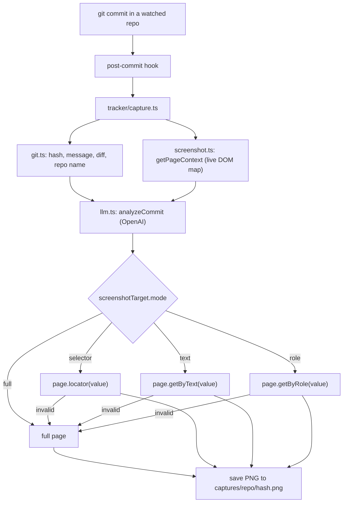

# DesignTrail

AI Design Iteration Tracker. Every time you commit code in a watched repo, DesignTrail
analyzes the change with an LLM, decides what part of the UI matters, and captures a
targeted Playwright screenshot. The goal is to build a visual + semantic history of how a
design evolves, commit by commit.

## How it works



The LLM runs **before** the screenshot. To keep its targeting grounded, DesignTrail first
reads a compact map of the **live rendered DOM** (`getPageContext`) and passes it to the
LLM alongside the diff. The LLM may only target elements that actually exist on the page,
which prevents it from hallucinating selectors. It returns structured JSON deciding what to
capture; the screenshot logic honors that decision and falls back to a full-page capture on
any failure (missing element, unreachable page, etc.).

## Requirements

- Node.js 20.12+ (uses the built-in `process.loadEnvFile`)
- A local dev server for the app you're tracking, running on the capture URL
  (default `http://localhost:3000`)
- An OpenAI API key

## Setup

```bash
npm install
npx playwright install   # downloads the Chromium browser Playwright drives
```

Create a `.env` file in this directory:

```bash
OPENAI_API_KEY=sk-...
# Optional: override the page the screenshot is taken against (default below)
CAPTURE_URL=http://localhost:3000
```

`.env` is git-ignored.

## Watching a repo

Use the installer to add the tracking hook to any git repo. No manual hook editing
required.

```bash
# Watch one repo
npm run track -- /path/to/some-repo

# Watch several at once
npm run track -- /path/to/repoA /path/to/repoB

# Watch the current directory (no argument)
npm run track
```

The installer ([tracker/install.ts](tracker/install.ts)):

- Verifies the target is a git repo and finds its hooks directory via
  `git rev-parse --git-path hooks` (respects `core.hooksPath` and worktrees).
- Writes a `post-commit` hook that calls this DesignTrail install. The DesignTrail path is
  derived from the script's own location, so it's correct wherever DesignTrail lives.
- Marks the hook executable.

It is safe to re-run:

- **Fresh repo** -> creates the hook.
- **Re-run** -> updates the DesignTrail block in place (no duplicates).
- **Repo with an existing hook** -> preserves it and appends the DesignTrail block, fenced
  by markers:

```sh
# >>> DesignTrail tracker >>>
DESIGNTRAIL="/abs/path/to/DesignTrail"
"$DESIGNTRAIL/node_modules/.bin/tsx" "$DESIGNTRAIL/tracker/capture.ts"
# <<< DesignTrail tracker <<<
```

## Unwatching a repo

Use the uninstaller to remove the tracking hook from a repo. Same argument style as
`track` (one repo, several repos, or the current directory with no argument).

```bash
# Stop watching one repo
npm run untrack -- /path/to/some-repo

# Stop watching several at once
npm run untrack -- /path/to/repoA /path/to/repoB

# Stop watching the current directory (no argument)
npm run untrack
```

The uninstaller ([tracker/uninstall.ts](tracker/uninstall.ts)):

- Resolves the hooks directory the same way as the installer (`git rev-parse --git-path
  hooks`).
- Removes the DesignTrail block whether it was installed with the marker fences or as a
  stand-alone hook.
- If the hook contained other commands, preserves them and removes only the DesignTrail
  part; if the hook existed only for DesignTrail, deletes the `post-commit` file entirely.
- Is safe to re-run and on repos that were never tracked (it leaves their hooks untouched).

## What happens on each commit

1. The watched repo's `post-commit` hook runs the tracker. git sets the working directory
   to that repo, so the tracker reads **that repo's** latest commit and diff, while loading
   its own dependencies and `.env` from the DesignTrail install.
2. `analyzeCommit` sends the commit message + diff to OpenAI and gets back structured JSON.
3. A targeted screenshot is captured based on the LLM's decision.
4. The PNG is saved to `captures/<repo-name>/<commit-hash>.png` inside DesignTrail (captures
   from all watched repos are centralized here and namespaced per repo).

Example console output:

```text
COMMIT: 2a26bfd45a3318bbecdfe6a17103bbad62c07b46
REPO: TempRepo

LLM SUMMARY:
Added sidebar navigation to dashboard

SCREENSHOT MODE:
selector

SCREENSHOT TARGET:
.sidebar
```

## LLM output contract

`analyzeCommit({ diff, commitMessage })` ([tracker/llm.ts](tracker/llm.ts)) returns:

```json
{
  "summary": "Added sidebar navigation to dashboard",
  "type": "UI_CHANGE",
  "screenshotTarget": {
    "mode": "selector",
    "value": ".sidebar"
  }
}
```

- `type` is one of `UI_CHANGE`, `FEATURE`, `REFACTOR`, `UNKNOWN`.
- `screenshotTarget.mode` is one of `full`, `selector`, `text`, `role`.
  - `full` -> full-page screenshot (no `value`).
  - `selector` -> `page.locator(value)` with a CSS selector.
  - `text` -> `page.getByText(value)`.
  - `role` -> `page.getByRole(value)` with an ARIA role.

To keep targeting accurate, `analyzeCommit` also receives a `uiContext` argument: a compact
map of the live page's real elements (tag, id, classes, role, `data-testid`, and visible
text) produced by `getPageContext` in [tracker/screenshot.ts](tracker/screenshot.ts). The
prompt instructs the model to target **only** elements present in that context and to prefer
`text`/`role` over guessed selectors. This is what prevents the model from inventing a class
like `.stat-total-commits` that isn't in the DOM. If the page can't be read (dev server
down), `uiContext` is empty and the model is told to use `full`.

The call uses OpenAI's JSON mode (`response_format: { type: "json_object" }`) to force
valid JSON, then validates the shape. On **any** failure (missing API key, network error,
parse error, invalid enum, or a non-`full` mode without a value) it returns a safe
fallback:

```json
{ "summary": "General layout change", "type": "UNKNOWN", "screenshotTarget": { "mode": "full" } }
```

If the chosen element can't be found on the page, the screenshot also falls back to
full-page. The system never crashes a commit.

## Configuration

| Variable         | Default                  | Purpose                                          |
| ---------------- | ------------------------ | ------------------------------------------------ |
| `OPENAI_API_KEY` | (required for analysis)  | Auth for the OpenAI call. Missing -> full-page fallback. |
| `CAPTURE_URL`    | `http://localhost:3000`  | The page the screenshot is taken against.        |

Read from `.env` in the DesignTrail root, regardless of which repo triggered the hook.

## Project layout

```text
tracker/
  capture.ts      Orchestrates the pipeline; resolves paths, loads .env, logs, saves capture
  git.ts          getLatestCommit, getDiff, getRepoName via simple-git
  llm.ts          analyzeCommit (OpenAI JSON mode, DOM-grounded) + safe fallback
  screenshot.ts   getPageContext(url) for live DOM map + takeScreenshot(outputPath, target, url) with full-page fallback
  install.ts      Installs the post-commit hook into target repos
  uninstall.ts    Removes the post-commit hook from target repos
  types.ts        CommitData, ScreenshotTarget, CommitAnalysis
captures/         Saved screenshots, namespaced as captures/<repo>/<hash>.png (git-ignored)
```

## Scripts

```bash
npm run capture           # Manually run the pipeline against the current repo/commit
npm run track -- <repo>   # Install the tracking hook into one or more repos
npm run untrack -- <repo> # Remove the tracking hook from one or more repos
```

## Manual testing

```bash
# Start the dev server for the app you track (must serve CAPTURE_URL)
# then, from the watched repo:
git commit -m "tweak layout"
# ...the tracker runs automatically and writes captures/<repo>/<hash>.png
```

## Notes and constraints

- Local and deterministic: no database and no third-party design tool integration.
- Screenshots require the dev server to be running; otherwise the capture step is skipped
  with a warning and the commit still succeeds.
- This is a hackathon project; the design intent is to grow toward component-level capture,
  semantic UI diffs, and intelligent design-exploration graphs.
```
