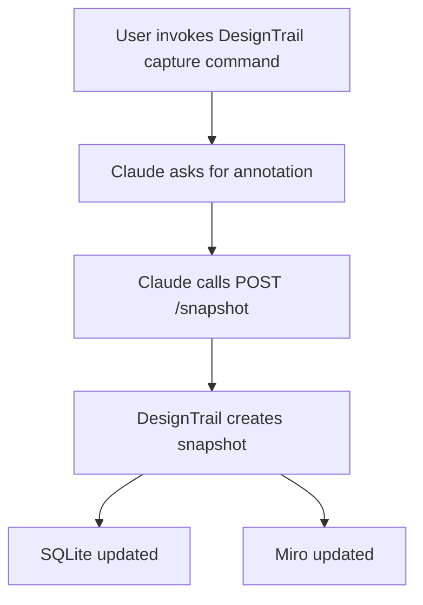

# Claude Integration

This folder documents the intended Claude integration for DesignTrail.

The goal is not to make Claude own the capture workflow. Claude should act as a
caller of the DesignTrail core service through a small API surface. DesignTrail
continues to own git inspection, screenshot capture, SQLite persistence, and Miro
sync.

## Intended Workflow

1. The user invokes a DesignTrail capture command from Claude.
2. Claude asks the user for a short annotation describing the intent of the change.
3. Claude sends the annotation to DesignTrail with `source: "claude"`.
4. DesignTrail runs the shared snapshot workflow.
5. DesignTrail stores the commit, component branches, nodes, screenshots, and geometry in SQLite.
6. DesignTrail syncs the resulting snapshot to Miro when Miro sync is enabled.

## Contract

The API contract for the future Claude command is documented in
[`capture-design.md`](./capture-design.md).

## Implementation Notes

- Claude should call DesignTrail through `POST /snapshot`.
- The endpoint should call `createDesignSnapshot(...)` from `src/core/snapshotService.ts`.
- Claude should pass `source: "claude"` so snapshots can be attributed to the integration.
- Claude should not shell out to `tracker/capture.ts`; that file remains a CLI adapter.
- The API layer should be thin: validate input, call the core service, and return the structured result.
