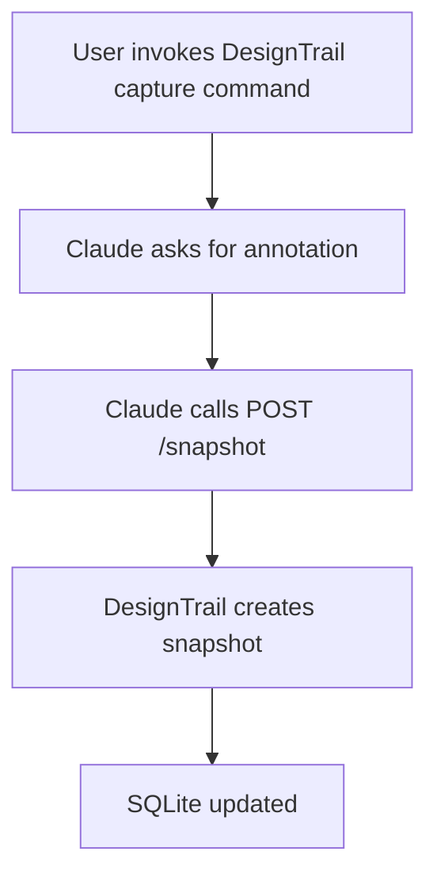

# Claude Integration

This folder documents the intended Claude integration for DesignTrail.

The goal is not to make Claude own the capture workflow. Claude should act as a
caller of the DesignTrail core service through a small API surface. DesignTrail
continues to own git inspection, screenshot capture, and SQLite persistence. Miro
board rendering is a separate manual step.

## Intended Workflow

1. The user invokes a DesignTrail capture command from Claude.
2. Claude asks the user for a short annotation describing the intent of the change.
3. Claude sends the target `repoPath`, annotation, and `source: "claude"` to DesignTrail.
4. DesignTrail runs the shared snapshot workflow.
5. DesignTrail stores the commit, component branches, nodes, screenshots, and geometry in SQLite.
6. The user can refresh Miro later with `npm run render-miro -- <repo>`.

## Contract

The API contract for the Claude command is documented in
[`capture-design.md`](./capture-design.md).

## Command

The recommended Claude Code slash command is installed as a user command at
`~/.claude/commands/capture-design.md`, so it can be run from any repository with
`/user:capture-design`. It is intentionally thin: collect an annotation, resolve
the current repository path, call `POST /snapshot`, and summarize the structured
response.

For local testing from `TempRepo`, the same command is also available as a
project command at `TempRepo/.claude/commands/capture-design.md`; run it as
`/project:capture-design` after restarting Claude Code in `TempRepo`.

## Implementation Notes

- Claude should call DesignTrail through `POST /snapshot`.
- The endpoint should call `createDesignSnapshot(...)` from `src/core/snapshotService.ts`.
- Claude should pass the absolute `repoPath` for the repository being captured.
- Claude should pass `source: "claude"` so snapshots can be attributed to the integration.
- Claude should not shell out to `tracker/capture.ts`; that file remains a CLI adapter.
- The API layer should be thin: validate input, call the core service, and return the structured result.
- The DesignTrail service should serve `/captures/...` so the manual Miro render can fetch screenshots through the configured public URL.
