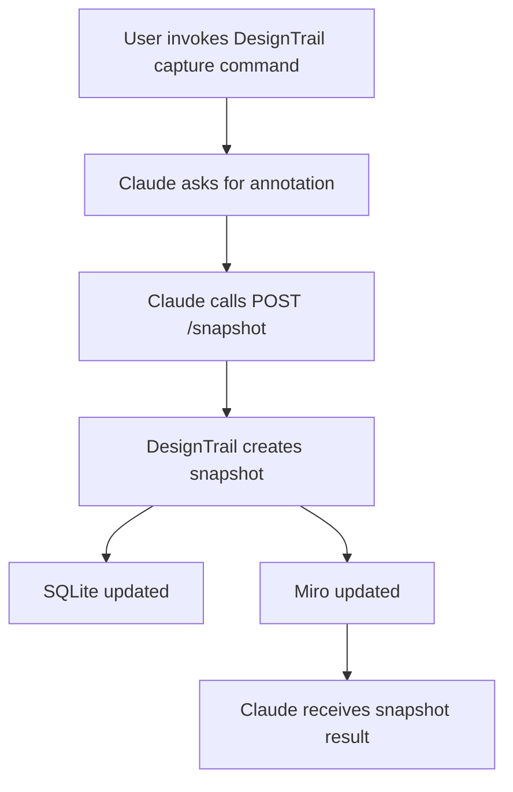

# Capture Design Command

This document defines the Claude-facing API contract for capturing a DesignTrail
snapshot.

The endpoint is backed by the existing DesignTrail service entry point:

```ts
createDesignSnapshot({
  repoPath,
  annotation,
  source: "claude",
  syncMiro,
});
```

## Workflow



## Request

```http
POST /snapshot
Content-Type: application/json
```

### Body

```json
{
  "repoPath": "/Users/mikezhang/Desktop/Development/TempRepo",
  "annotation": "Adjusted the project card accent color after design review.",
  "source": "claude",
  "syncMiro": true
}
```

### Fields

| Field | Type | Required | Description |
| --- | --- | --- | --- |
| `repoPath` | `string` | Yes | Absolute path to the repository whose latest commit should be captured. |
| `annotation` | `string` | No | Human-readable note collected by Claude before capture. |
| `source` | `string` | No | Integration identifier. Defaults to `"claude"` when omitted. |
| `syncMiro` | `boolean` | No | Whether to sync the snapshot to Miro. Omit or pass `true` for full sync; pass `false` for local-only tests. |

## Response

### Success

```http
200 OK
Content-Type: application/json
```

```json
{
  "success": true,
  "commit": {
    "hash": "2d09119b688ac1c7e9398dc5452d1fbe07123ce4",
    "message": "Update project card accent color",
    "timestamp": 1781097600000,
    "source": "claude",
    "annotation": "Adjusted the project card accent color after design review."
  },
  "repoName": "TempRepo",
  "repoPath": "/Users/mikezhang/Desktop/Development/TempRepo",
  "entries": [
    {
      "branchId": "main",
      "parentBranchId": null,
      "parentId": null,
      "type": "UI_CHANGE",
      "summary": "Updated accent color on the Projects page.",
      "screenshotPath": "captures/TempRepo/2d09119b688ac1c7e9398dc5452d1fbe07123ce4/main.png"
    }
  ],
  "screenshotCount": 1,
  "miroSynced": true
}
```

### Response Shape

| Field | Type | Description |
| --- | --- | --- |
| `success` | `boolean` | `true` when snapshot creation completed. |
| `commit` | `object` | Git commit metadata and integration attribution. |
| `repoName` | `string` | Name of the repository captured. |
| `repoPath` | `string` | Absolute path to the repository captured. |
| `entries` | `array` | Component graph nodes created for this snapshot. |
| `screenshotCount` | `number` | Number of screenshots successfully written during capture. |
| `miroSynced` | `boolean` | `true` when a Miro timeline node was created; `false` when Miro sync was disabled or skipped. |

### Validation Error

```http
400 Bad Request
Content-Type: application/json
```

```json
{
  "success": false,
  "error": "repoPath is required and must be a non-empty string"
}
```

## Notes

- The API should call the reusable snapshot service, not the CLI script.
- The endpoint loads DesignTrail configuration from the DesignTrail root.
- SQLite persistence happens inside the snapshot service.
- Miro sync happens after screenshots are captured and persisted.
- The DesignTrail service serves generated screenshots from `/captures/...`; ngrok should point at the service port when Miro needs public image URLs.
