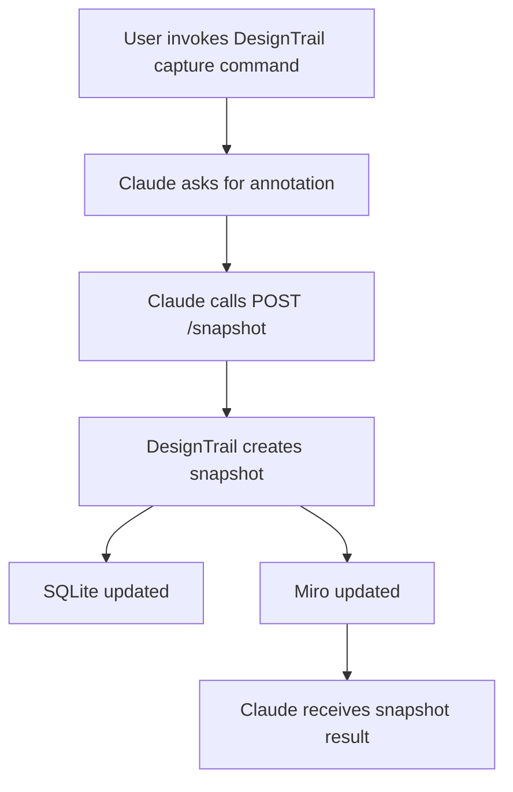

# Capture Design Command

This document defines the intended Claude-facing API contract for capturing a
DesignTrail snapshot.

The endpoint described here is a future integration surface. It should be backed
by the existing DesignTrail service entry point:

```ts
createDesignSnapshot({
  annotation,
  source: "claude",
});
```

## Workflow



## Request

```http
POST /snapshot
Content-Type: application/json
```

### Body

```json
{
  "annotation": "Adjusted the project card accent color after design review.",
  "source": "claude"
}
```

### Fields

| Field | Type | Required | Description |
| --- | --- | --- | --- |
| `annotation` | `string` | No | Human-readable note collected by Claude before capture. |
| `source` | `string` | Yes | Integration identifier. Claude should send `"claude"`. |

## Response

### Success

```http
200 OK
Content-Type: application/json
```

```json
{
  "ok": true,
  "snapshot": {
    "commit": {
      "hash": "2d09119b688ac1c7e9398dc5452d1fbe07123ce4",
      "message": "Update project card accent color",
      "timestamp": 1781097600000,
      "repoName": "TempRepo",
      "source": "claude",
      "annotation": "Adjusted the project card accent color after design review."
    },
    "repoName": "TempRepo",
    "entries": [
      {
        "branchId": "main",
        "parentBranchId": null,
        "parentId": null,
        "type": "UI_CHANGE",
        "summary": "Updated accent color on the Projects page.",
        "screenshotPath": "captures/TempRepo/2d09119b688ac1c7e9398dc5452d1fbe07123ce4/main.png"
      }
    ],
    "screenshots": [
      {
        "outputPath": "/Users/mikezhang/Desktop/Development/DesignTrail/captures/TempRepo/2d09119b688ac1c7e9398dc5452d1fbe07123ce4/main.png"
      }
    ],
    "miroNode": {
      "commitHash": "2d09119b688ac1c7e9398dc5452d1fbe07123ce4",
      "miroNodeId": "3458764675060949060",
      "nodeType": "sticky_note",
      "commitIndex": 0,
      "position": {
        "x": 0,
        "y": 0
      },
      "previousNodeId": null,
      "createdAt": "2026-06-10T14:09:00.000Z"
    }
  }
}
```

### Response Shape

| Field | Type | Description |
| --- | --- | --- |
| `ok` | `boolean` | `true` when snapshot creation completed. |
| `snapshot.commit` | `object` | Git commit metadata and integration attribution. |
| `snapshot.repoName` | `string` | Name of the repository captured. |
| `snapshot.entries` | `array` | Component graph nodes created for this snapshot. |
| `snapshot.screenshots` | `array` | Screenshots written during capture. |
| `snapshot.miroNode` | `object \| null` | Miro timeline node, or `null` when Miro sync is disabled or skipped. |

## Notes

- The API should call the reusable snapshot service, not the CLI script.
- The endpoint should load DesignTrail configuration from the DesignTrail root.
- SQLite persistence happens inside the snapshot service.
- Miro sync happens after screenshots are captured and persisted.
- Future versions may add `repoPath` and `syncMiro` to the request body when Claude needs to target a specific repository or run local-only captures.
